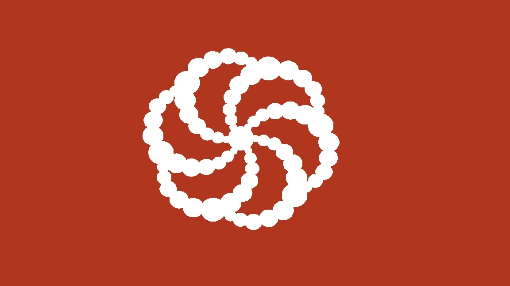

# 🧠 Codewars Solutions

**Codewars** is an online platform for practicing coding skills, solving problems, and learning new programming languages through a wide variety of challenging tasks, or 'katas,' of different difficulty levels.

    
    
    
    
    
    
    
    
    
    
    
    
    
    
    
    
    
    

---